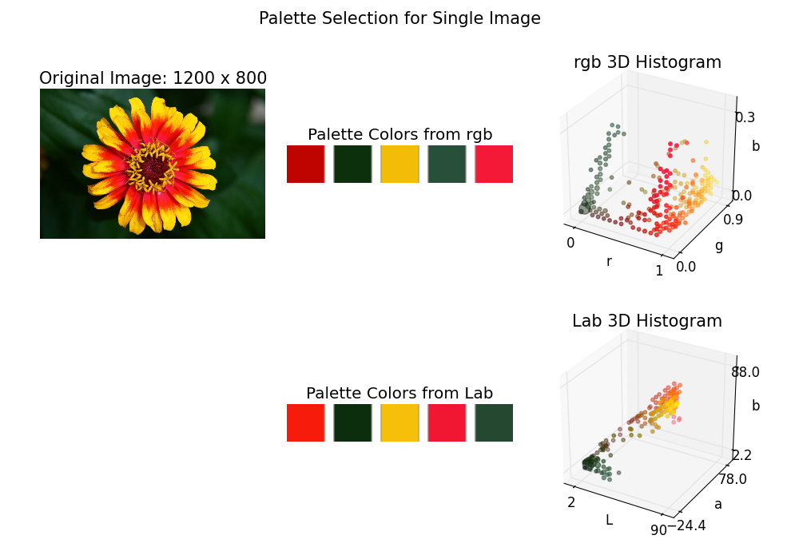
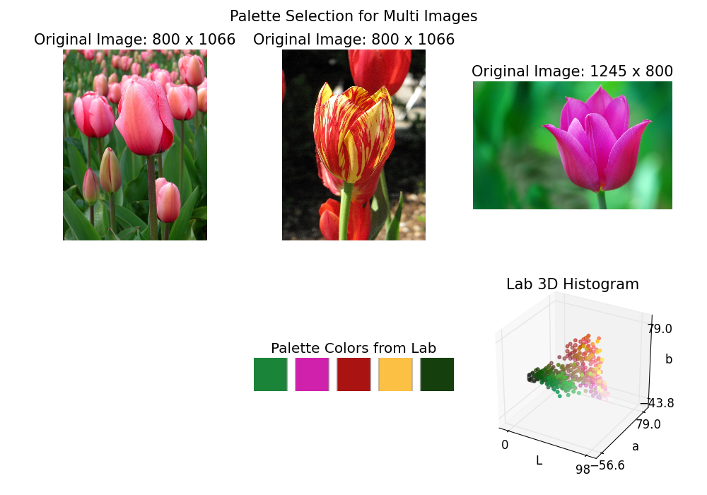

Automatic Color Palette Selection (Python)
====

Simple python demos of Automatic Color Palette Selection [Garcia-Dorado et al. 2015].

They proposed **palette-based photo recoloring** method for image editing.

I will implement automatic color palette selection part for a single image.

## Examples

### Palette Selection for Single Image:

#### Minimal example:

``` python
from palette.io_util.image import loadRGB
from palette.core.hist_3d import Hist3D
from palette.core.palette_selection import PaletteSelection
import matplotlib.pyplot as plt

# Load image.
image = loadRGB(image_file)

# 16 bins, Lab color space
hist3D = Hist3D(image, num_bins=16, color_space='Lab')

color_coordinates = hist3D.colorCoordinates()
color_densities = hist3D.colorDensities()
rgb_colors = hist3D.rgbColors()

# 5 colors from Lab color samples.
palette_selection = PaletteSelection(color_coordinates,
                                             color_densities, rgb_colors,
                                             num_colors=5, sigma=70.0)

fig = plt.figure()

# Plot image.
fig.add_subplot(131)
plt.imshow(image)
plt.axis('off')

# Plot palette colors.
fig.add_subplot(132)
palette_selection.plot(plt)
plt.axis('off')

# Plot 3D color histogram.
ax = fig.add_subplot(133, projection='3d')
hist3D.plot(ax)

plt.show()

```

In the following demo, I compare the palette selection results by changing ```color_space```.



### Palette Selection for Multi-Images:

In the following demo, I test the palette selection for multi-images.



## Installation

*Note*: This program was only tested on **Windows** with **Python2.7**.
**Linux** and **Mac OS** are not officially supported,
but the following instructions might be helpful for installing on those environments.

### Dependencies
Please install the following required python modules.

* **NumPy**
* **SciPy**
* **matplotlib**
* **OpenCV**

As these modules are heavily dependent on NumPy modules, please install appropriate packages for your development environment (Python versions, 32-bit or 64-bit).
For 64-bit Windows, you can download the binaries from [**Unofficial Windows Binaries for Python Extension Packages**](http://www.lfd.uci.edu/~gohlke/pythonlibs/).

<!-- This program also uses **docopt** for CLI.
**docopt** will be installed automatically through the following **pip** command for main modules. -->

### Install main modules
You can use **pip** command for installing main modules.
Please run the following command from the shell.

``` bash
  > pip install git+https://github.com/tody411/PaletteSelection.git
```

## Usage
### Run Palette Selection Demo

* [```palette/main.py```](palette/main.py):

You can test the Palette Selection with the following command from ```palette``` directory.
``` bash
  > python main.py
```

This command will start downloading test images via Google Image API then run the demo module to generate result images.

### Examples Codes
* [```palette/examples```](palette/examples): You can find minimal example codes.
* [```palette/results```](palette/results): You can also find examples codes to generate result images.

<!-- ## API Document

API document will be managed by [doxygen](http://www.stack.nl/~dimitri/doxygen/) framework.
Online version is provided in the following link:
* [**inversetoon API Document**](http://tody411.github.io/InverseToon/index.html) (html)

For a local copy, please use the following doxygen command from *doxygen* directory.
``` bash
  > doxygen doxygen_config
``` -->

<!-- ## Future tasks

* [ ] Compare the palette selection results depending on the target color space. -->

## License

The MIT License 2015 (c) tody